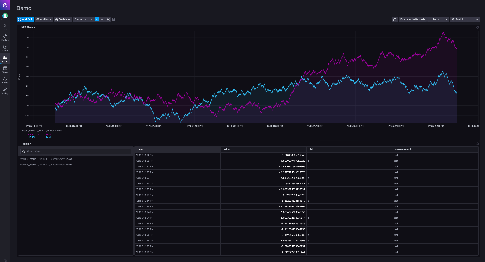

# High Throughput Data Aggregation

Modified: 2022-04

Python Influx client for storing Near Real-Time data.

## Quickstart
You will need docker engine and `docker-compose` installed on your system. Installing docker is system dependant see [here](https://docs.docker.com/get-docker/) for installation instructions. You can install docker compose through pip:
```bash
python3 -m pip install docker-compose
```

```bash
docker-compose up
```

Once the services spin up head to http://localhost:8086 on your local browser to login to the influx client. The username and password for this instance is defined [here](.env) feel free to change any of the default influx config I have set.

I have supplied an influx dashboard for viewing the datastream [here](/etc/demo-dashboard.json). Simply select the import dashboard option on the client web interface and load in the supplied json. Unfortunately influx does not allow us to mount the dashboard directly so this step will remain a manual one.

Once the dashboard is loaded you should see a batch read of data:


I have written a simple python module which simulates an incoming high bandwidth data stream. I have packaged the module into a docker service named `influxclient` which networks with the active `influx` database instance. It performs a batch write to the database as soon as the buffer is filled.


To teardown the services and resources:
```bash
docker-compose down --rmi all
```

## Hints
Purging the influx bucket
```bash
influx delete --org demo --token random-token --bucket telemetry \
  --start '1970-01-01T00:00:00Z' \
  --stop $(date +"%Y-%m-%dT%H:%M:%SZ")
```

## License
This project is licensed under the terms of the [MIT License](LICENSE)